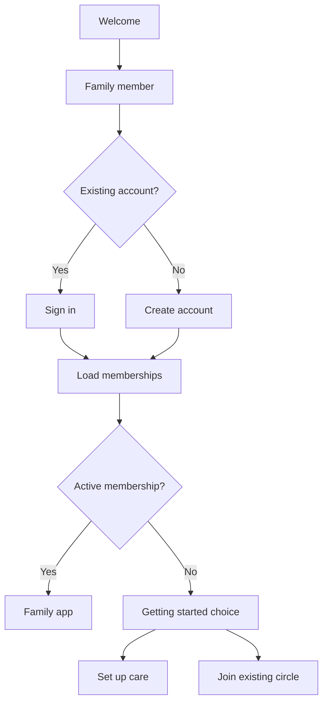
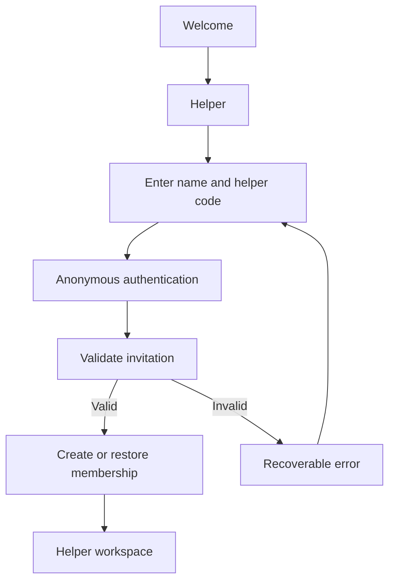
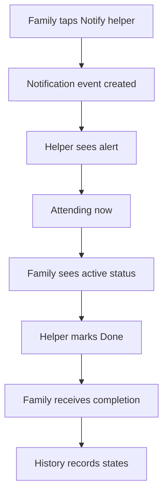

# RemoteLove User Journeys and Cross-Tab Navigation

## Purpose

This document defines the intended user journey for RemoteLove's authentication flows, primary tabs, supporting screens and cross-tab navigation. It should be read together with `RemoteLove_DOMAIN_MODEL.md`.

The exact visual layout may adapt between iPhone and iPad, but the underlying destination, selected CareRecipient, permissions and data state must remain consistent.

## Core navigation principles

1. Every care-related destination must retain a `CareRecipient` identifier.
2. Global profile selection and Overview filtering are separate concepts.
3. A deep link must open the correct tab, recipient and record.
4. Returning from a cross-tab destination should preserve the user's previous context where practical.
5. Owners, family members, helpers and viewers see only destinations allowed by their membership.
6. Hiding a tab is not sufficient security; Supabase must enforce access.
7. Successful create, edit, delete, complete, acknowledge and permission actions create audit-history records.
8. Loading, empty, error and permission-denied states must be explicit.
9. The helper experience must remain task-focused and must not expose the Family tab or unrestricted health management.

## Role and tab visibility

| Destination | Owner | Family | Helper | Viewer |
|---|---:|---:|---:|---:|
| Overview | Full | Permission-based | Simplified if included | Read-only |
| Family | Full | Permission-based | No access | No access unless explicitly designed as read-only |
| Helper | Preview/monitoring where relevant | Monitoring where permitted | Primary workspace | No editing |
| Planner | Full | Permission-based | Only assigned/relevant information | Read-only if permitted |
| Health Monitor | Full | Permission-based | No dashboard unless explicitly permitted | Read-only if permitted |
| Activity History | Full | Permission-based | Own/permitted actions only | Read-only if permitted |
| Care Circle | Full management | Permission-based | Own membership only | Own membership only |
| Settings | Yes | Yes | Yes | Yes |

The physical tab bar may use a `More` destination on smaller devices. This must not remove access to permitted screens.

---

# 1. Entry, authentication and onboarding

## 1.1 Welcome

**Entry:** App launch with no restorable session.

**Primary choices:**

- I'm a family member
- I'm a helper
- Demo access, if retained and clearly isolated

**Family path:**



### Set up care for someone

1. Authenticated family user chooses **Set up care for someone**.
2. User creates the first care profile.
3. Backend creates the care workspace, `CareRecipient` and owner membership atomically or with recoverable steps.
4. Family and helper invitation mechanisms become available.
5. App opens the Family experience with the new recipient selected.

### Join an existing family care circle

1. Authenticated family user chooses **Join an existing family care circle**.
2. User enters a family invitation code.
3. Supabase validates invitation type, status, role, permissions and recipient access.
4. Existing care profiles load without creating duplicates.
5. App opens the Family experience with an accessible recipient selected.

## 1.2 Helper join



The helper route never requests an email, creates a family account or creates a CareRecipient.

## 1.3 Session restoration

1. App starts in a loading/restoring state.
2. Restore Supabase session.
3. Load profile, active memberships, roles and accessible recipients.
4. Route to Family or Helper experience from server-backed membership data.
5. If membership was removed, clear cached care data and return to the appropriate entry route.

---

# 2. Global people-receiving-care selector

## Goal

Allow authorised users to switch between Mum, Dad or other care recipients without mixing their records.

## Journey

1. User taps **People receiving care**.
2. Selector expands with an animated list of permitted recipients.
3. User selects a recipient.
4. Global `selectedRecipientID` changes.
5. Overview, Family, Planner, Health and History reload for that recipient.
6. Any open record that does not belong to the new recipient closes safely.

## All profiles behaviour

- `All profiles` may be available in Overview and History as a local filter.
- Selecting `All profiles` inside Overview must not overwrite or disable the global recipient selector.
- Tapping an aggregated card must route using the card's own `recipientID`.

---

# 3. Overview tab

## Purpose

Provide a fast summary of everything needing attention across one or all permitted care profiles.

## Entry state

- Current global recipient, or an Overview-only `All profiles` filter.
- Latest completion, medicine, appointment, health and care-circle data.

## Main sections

- Today's Care
- Care profile and key condition summary
- Task completion rate
- Medicine needing attention
- Upcoming appointments
- Health trends or latest readings
- Care Circle summary
- Unacknowledged alerts

## Journey

1. User opens Overview.
2. App displays loading skeletons, then current summaries.
3. User chooses one recipient or `All profiles` within Overview.
4. User taps or hovers/long-presses a card for more detail.
5. User taps a specific item to navigate to the owning tab and record.

## Cross-tab routes

| Overview item | Destination | Required context |
|---|---|---|
| Today's incomplete task | Family task detail | `recipientID`, `taskID`, occurrence date |
| Helper task status | Family/helper update detail | `recipientID`, `taskID`, status |
| Medicine needs attention | Planner medicine detail | `recipientID`, `medicineID` |
| Upcoming appointment | Planner appointment detail | `recipientID`, `appointmentID` |
| Health trend | Health category trend | `recipientID`, category |
| Care Circle member | Care Circle member detail | `recipientID`, `membershipID` |
| Emergency alert | Alert acknowledgement | `recipientID`, `alertID` |

## Empty states

- No tasks today: show a calm, positive status rather than an error.
- No medicines: offer Planner access only to authorised roles.
- No health readings: explain how authorised family can add the first reading.
- No alerts: do not display an empty warning panel.

---

# 4. Family tab

## Purpose

Allow owners and authorised family members to create, organise and monitor daily care.

## Main sections

- Attention alerts at the top
- Today's timeline
- Task completion summary
- Task creation and editing
- Bulk task management
- Helper updates and replies
- Praise helper
- Latest update, only when an update exists

## Create-task journey

1. User confirms the selected CareRecipient.
2. Taps **Add task**.
3. Enters task name; instructions remain optional.
4. Selects first time and repeat rule.
5. Optionally links a medicine.
6. Optionally requires a completion photo.
7. Saves.
8. Backend creates the task and generated occurrences.
9. Task appears in the correct chronological timeline.
10. Overview totals update live.
11. Relevant helper workspace updates.
12. History receives a task-created event.

## Edit and bulk-management journey

1. User opens an existing task or selects multiple tasks.
2. User edits, pauses, cancels or removes permitted tasks.
3. Destructive action requires confirmation.
4. Backend applies the action to the intended task/occurrence scope.
5. Timeline, Overview and Helper refresh.
6. History records actor, action and affected task IDs.

## Notify-helper journey



## Updates and communication

1. Helper submits text/photo update.
2. Family receives update against the correct recipient.
3. Family may type a reply or send an approved emoji reaction.
4. Family may praise the helper.
5. Conversation/update is visible only to authorised members.
6. Relevant actions are written to History.

## Cross-tab routes

- Linked medicine → Planner medicine detail.
- Task completion photo → full-screen secure photo viewer.
- Helper identity → Care Circle member detail.
- Health-related update → Health Monitor for the same recipient/category.
- Emergency alert → acknowledgement screen and Care Circle escalation status.

---

# 5. Helper tab

## Purpose

Give helpers a simple daily workflow without family administration or unnecessary dashboards.

## Main sections

- Selected/assigned recipient
- Urgent or notified tasks
- Today's chronological task list
- Quick update
- Emergency alert
- Recent acknowledgement or praise

## Daily-task journey

1. Helper opens the app through a valid helper session.
2. App loads only assigned/permitted recipients and tasks.
3. Notified tasks appear prominently.
4. Helper may choose **Attending now**.
5. Family sees the attending state immediately.
6. Helper follows task instructions.
7. If a photo is required, **Done** remains unavailable until a photo is captured or selected.
8. Helper taps **Done**.
9. Backend records completion idempotently.
10. Linked medicine supply decreases once, when applicable.
11. Family timeline and Overview refresh.
12. History records completion and evidence metadata.

## Quick-update journey

1. Helper taps **Send update**.
2. Enters optional text and may take/upload a photo.
3. Confirms the correct recipient.
4. Sends update.
5. Family receives the update in the Family tab.
6. Family can reply or react.

## Emergency journey

1. Helper taps emergency control.
2. Confirmation prevents accidental submission.
3. Server creates an emergency event for the correct recipient.
4. Eligible family members receive notification/escalation.
5. First family member acknowledges and identifies themselves.
6. Helper sees acknowledgement status.
7. History records creation, delivery attempts, acknowledgement and resolution.

## Restrictions

- Helper cannot navigate to Family.
- Helper cannot manage roles, permissions or invitations.
- Helper cannot access unrelated recipients by changing an identifier.
- Helper does not receive the full Health dashboard unless an explicit approved permission exists.

---

# 6. Planner tab

## Purpose

Unify medicines, appointments, important dates and calendar visibility without creating duplicate records in other tabs.

## Main sections

- Medicine and appointment alerts at the top
- Add appointment
- Add medicine
- Calendar
- Active/inactive medicines
- Important dates
- Needs-attention threshold

## Medicine journey

1. User confirms recipient.
2. Taps **Add medicine**.
3. Enters name, details, dose, unit, schedule, starting supply and refill threshold.
4. Optionally captures a medicine photo.
5. Saves.
6. Backend creates medicine plus schedule.
7. Calendar renders future schedule occurrences.
8. Related daily helper tasks are generated or derived without duplicate manual entry.
9. Overview reflects supply/attention state.
10. History records creation.

## Edit, disable and supply journey

1. User opens a medicine.
2. Edits details, schedule, current supply or threshold.
3. User may toggle medicine inactive when no longer taken.
4. Inactive medicine stops future calendar occurrences and helper tasks without deleting past history.
5. Saving refreshes Planner, Family/Helper tasks and Overview.
6. History records the change.

## Appointment journey

1. User taps **Add appointment** at the top of Planner.
2. Enters date, time, provider, location, notes and reminder preference.
3. Optional external booking link is selected according to the user's country.
4. Saving creates one appointment record.
5. Calendar shows the appointment.
6. Overview shows it when upcoming.
7. Three-day reminder is scheduled when enabled.
8. Edit/cancel/remove updates every reference and History.

## Calendar journey

1. User browses month/week/day.
2. Dates indicate medicine schedules, appointments and important dates.
3. Hover on pointer devices or long-press/tap on touch displays shows a daily summary.
4. Selecting an item opens its medicine or appointment detail.
5. Back returns to the same calendar date.

## Cross-tab routes

| Planner event | Cross-reference |
|---|---|
| Medicine occurrence | Helper/Family task for the same occurrence |
| Completed medicine task | Decrease medicine supply once |
| Needs-attention medicine | Overview alert |
| Appointment within alert window | Overview and Family alert |
| Health follow-up appointment | Health category/detail link where applicable |
| Any create/edit/cancel action | History event |

---

# 7. Health Monitor tab

## Purpose

Record health readings and daily habits over time so authorised users can understand trends and share useful history with clinicians.

## Main sections

- Log health update
- Category selector
- Category-specific input and unit
- Selected-category reference guidance
- Recent history
- Category filter
- Trend chart
- Category CSV download

## Log-reading journey

1. User confirms recipient.
2. Taps **Log health update**.
3. Chooses what is being recorded.
4. Form changes its reading prompt, fields and unit for the selected category.
5. Only the relevant reference range/guidance is shown.
6. User enters reading, optional note and timestamp.
7. Save validates value and unit.
8. History list and trend chart update.
9. Overview latest health summary updates.
10. Activity History records the log action.

## Review and export journey

1. User chooses a health category filter.
2. List and trend chart show only that category.
3. User chooses the relevant time range where supported.
4. User downloads CSV for that category.
5. Export includes recipient context, timestamps, values and units, while warning that the file is sensitive.

## Safety rules

- Reference charts provide context, not diagnosis.
- Store source and review date for reference ranges.
- Do not label a person healthy/unhealthy solely from a single reading.
- Helpers do not receive unrestricted Health access.

## Cross-tab routes

- Overview health card → selected category trend.
- Helper permitted reading → Health history for the same recipient/category.
- Health follow-up action → Planner appointment creation with recipient retained.
- Edited/deleted reading → History record.

---

# 8. Activity History tab

## Purpose

Provide a read-only audit trail showing what changed, who acted and which recipient was affected.

## Main filters

- One recipient or all permitted profiles
- Action category
- Actor role
- Date range, if implemented

## Journey

1. User opens History.
2. App loads permitted audit entries newest first.
3. User filters by recipient, action category or role.
4. User opens an event.
5. Event displays actor, role, recipient, action, details and timestamp.
6. If the referenced record still exists and access is permitted, user may open it in its owning tab.
7. If it was deleted, History shows a non-editable snapshot rather than a broken link.

## Cross-tab ownership

| History category | Destination |
|---|---|
| Task | Family task detail |
| Medicine | Planner medicine detail |
| Appointment | Planner appointment detail |
| Health | Health reading/category |
| Member or permission | Care Circle member detail |
| Emergency | Alert event detail |
| Message/update | Family or Helper update detail |

History records cannot be modified or deleted from the client.

---

# 9. Care Circle tab

## Purpose

Show who is involved in care and allow authorised users to manage invitations, roles, permissions and escalation responsibilities.

## Main sections

- Current recipient/care-circle context
- Owners, family, helpers and viewers
- Family invitation
- Helper invitation
- Permission details
- Remove/deactivate member
- Escalation order and safety rules

## Invite-family journey

1. Owner or authorised family member selects recipient/circle scope.
2. Creates family invitation with intended role and permissions.
3. Shares code through an external method chosen by the user.
4. Recipient creates/signs into a family account.
5. Recipient redeems family invitation.
6. Membership appears in Care Circle.
7. History records invitation and redemption.

## Invite-helper journey

1. Authorised family creates helper invitation for the correct profile.
2. Helper enters name and helper code through helper onboarding.
3. Helper membership appears in the care circle.
4. Family can edit allowed details/permissions or deactivate the helper.
5. Deactivation removes future access but retains past audit entries.

## Permission journey

1. Owner opens a member.
2. Reviews role and permission level.
3. Changes permitted settings.
4. Confirmation explains impact.
5. Backend updates membership and invalidates access where required.
6. Relevant tabs refresh immediately.
7. History records before/after permission summary.

## Cross-tab routes

- Member helper → Family helper updates and praise history.
- Escalation responder → Emergency acknowledgement status.
- Permission change → History.
- Recipient/circle switch → Global selector where appropriate.
- Account/privacy management → Settings.

---

# 10. Settings tab

## Purpose

Manage the current identity, appearance, notifications, privacy and session.

## Main sections

- Signed-in identity and access type
- Light/dark appearance
- Notification preferences
- Privacy and data controls
- Help and legal information
- Logout
- Account deletion for registered family accounts
- Leave care circle or unlink helper session where applicable

## Logout journey

1. User taps **Log out**.
2. Confirmation explains that local session data will be cleared.
3. Supabase session signs out.
4. Selected recipient, cached role, navigation path and sensitive local data clear.
5. App returns to Welcome.

## Privacy journey

1. User opens Privacy & Data.
2. Reviews collected-data explanation.
3. Can request/export permitted data.
4. Can leave a care circle or initiate account deletion according to role.
5. Ownership conflicts must be resolved before owner deletion.

## Cross-tab routes

- Manage memberships → Care Circle.
- Notification category → owning feature where useful.
- Data export → Health or account-wide export as appropriate.
- Logout → Welcome.

---

# 11. Global alert and notification journeys

Alerts may open the app outside its normal tab sequence. Every notification must carry sufficient identifiers to resolve the correct authorised destination.

| Notification | Destination | Required identifiers |
|---|---|---|
| Task notification | Helper task detail | recipient, task, occurrence |
| Attending now | Family task status | recipient, task, occurrence |
| Task completed | Family task detail | recipient, task, completion |
| Medicine refill | Planner medicine detail | recipient, medicine |
| Appointment reminder | Planner appointment detail | recipient, appointment |
| Helper update | Family update detail | recipient, update |
| Family reply/praise | Helper update detail | recipient, message/update |
| Emergency | Emergency acknowledgement | recipient, alert |

If the user lacks access, show a safe permission message and do not leak the recipient's name or record details.

---

# 12. Cross-tab state contract

Every cross-tab route should use a typed destination containing identifiers rather than relying on display names or global mutable flags.

Conceptual example:

```swift
enum AppDestination: Hashable {
    case overview(recipientID: UUID?)
    case task(recipientID: UUID, taskID: UUID, occurrenceID: UUID?)
    case medicine(recipientID: UUID, medicineID: UUID)
    case appointment(recipientID: UUID, appointmentID: UUID)
    case health(recipientID: UUID, category: String?)
    case member(recipientID: UUID, membershipID: UUID)
    case history(recipientID: UUID?, eventID: UUID?)
    case emergency(recipientID: UUID, alertID: UUID)
}
```

The existing architecture may use different types or identifiers. Preserve the same principles:

- Destination is explicit.
- Recipient is explicit.
- Permission is checked before data is shown.
- Destination waits for required data to load.
- Back navigation is predictable.
- Tab selection and detail navigation are updated together.

---

# 13. Cross-reference matrix

| Source | Trigger | Destination | Expected result |
|---|---|---|---|
| Overview | Tap incomplete task | Family | Correct task and recipient |
| Overview | Tap medicine alert | Planner | Correct medicine detail |
| Overview | Tap appointment | Planner | Correct appointment detail |
| Overview | Tap health card | Health | Correct category trend |
| Overview | Tap care member | Care Circle | Correct membership |
| Family | Link medicine | Planner | Medicine detail |
| Family | Notify helper | Helper | Persistent task alert |
| Helper | Attending now | Family | Live attending status |
| Helper | Done | Family/Overview | Updated completion totals |
| Helper | Complete medicine task | Planner | Supply reduced once |
| Helper | Quick update | Family | Update with optional photo |
| Helper | Emergency | Family/Care Circle | Alert and acknowledgement |
| Planner | Medicine schedule | Helper/Family | Derived daily task |
| Planner | Appointment reminder | Overview/Family | Upcoming alert |
| Health | Create follow-up | Planner | Appointment draft with context |
| Any modifying tab | Successful action | History | Audit entry |
| History | Open existing record | Owning tab | Correct record detail |
| Care Circle | Change permission | All tabs | Access refreshes immediately |
| Settings | Logout | Welcome | Session and sensitive state cleared |

---

# 14. Required journey checks

For every journey, verify:

1. Correct role can see the entry control.
2. Incorrect role cannot access the destination by tab, deep link or identifier manipulation.
3. The correct CareRecipient remains selected.
4. Loading and network errors are recoverable.
5. A failed attempt does not block a later valid attempt.
6. Repeated taps do not create duplicate records.
7. Created/edited data appears everywhere it is referenced.
8. Deleted or disabled data disappears from future workflows but retains appropriate history.
9. Back navigation returns to a sensible location.
10. iPhone and iPad navigation expose the same permitted functionality.

## Codex usage instruction

When using this file to inspect or implement RemoteLove:

1. Compare these journeys against the actual current tabs and navigation code.
2. Report mismatches before making broad changes.
3. Do not invent a new tab when an existing destination can support the journey.
4. Preserve the approved visual design.
5. Implement one bounded journey at a time.
6. Add XCUITest coverage for primary and cross-tab routes.
7. Build and test before marking a journey complete.
